# GCP Infrastructure Automation with Terraform
> A real-world example of automating Google Cloud infrastructure using Terraform modules and GitHub Actions, including private Cloud SQL, IAM auth, VPC setup, and CI/CD pipelines with manual approval controls.

## Project Overview

This is a demo Terraform-based GCP infrastructure project designed for DevOps automation practice.  Below are some evidence to show a demo project being set up to meet the following needs;

- VPC setup with custom subnet
- Cloud SQL PostgreSQL with IAM auth
- Modular Terraform codebase
- GCS backend for state storage

## Project Outcome - along with issues, resolutions, tips, tricks and findings

### 1. Create Project Directory Locally in VS Code
Screenshot 1: Project folder opened in VS Code with terminal showing scaffolded structure \
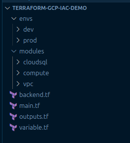

### 2. Create GitHub Repository

**Initialize Git & Connect to GitHub and the problems that were dealt with along the way**

- Initialized Git with `git init`
- Renamed default branch from `master` to `main` using `git branch -M main`
- Linked to GitHub with `git remote add origin ...`
- Pull the remote content and merge it `git pull origin main --allow-unrelated-histories`
- Merge histories `git pull origin main --allow-unrelated-histories --no-rebase`
- Committed scaffold files and pushed to GitHub with `git push -u origin main`

Screenshot 2: GitHub repo page after first push showing code + folder structure \
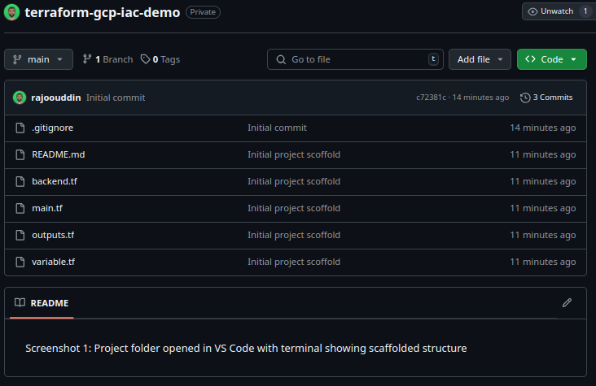

### 3. Create GCP Project
Screenshot 3: GCP project dashboard after creation \
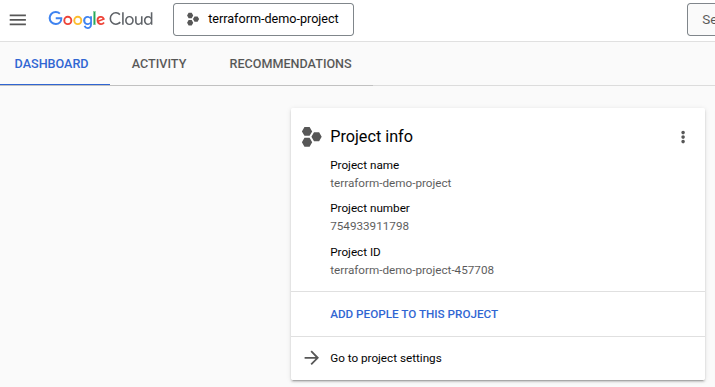

### 4. Enable Required APIs
**API Enablement Notes**

Due to restricted IAM roles on some accounts, API enablement was done through the GCP Console UI rather than via CLI. This is common in org-managed identities where permissions are scoped tightly.

To view enabled APIs:
- Visit [GCP API Dashboard](https://console.cloud.google.com/apis/dashboard?project=YOUR_PROJECT_ID)
- Confirm APIs like Compute Engine, Cloud SQL Admin, IAM, Cloud Resource Manager, and GCS are enabled.

Screenshot 4: API library screen showing enabled APIs \
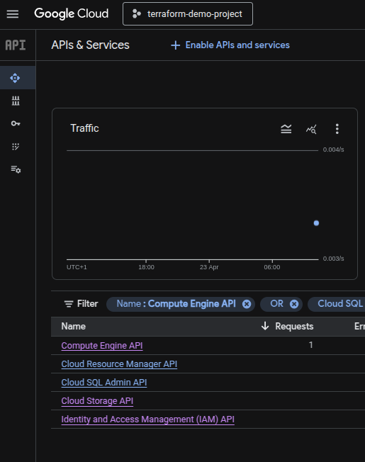

> **NOTE**: make sure the project id is used instead of the project name as this can cause issues running CLI commands

### 5. Create a Terraform Service Account
Screenshot 5: IAM page showing service account + key created \
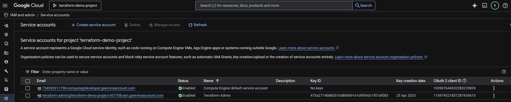

### 6. Create Terraform Backend Bucket
Screenshot 6: GCS bucket shown in the GCP console \
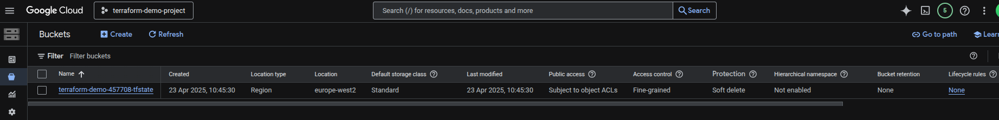

### 7. Initialize Terraform
Screenshot 7: Terminal showing successful `terraform init` \
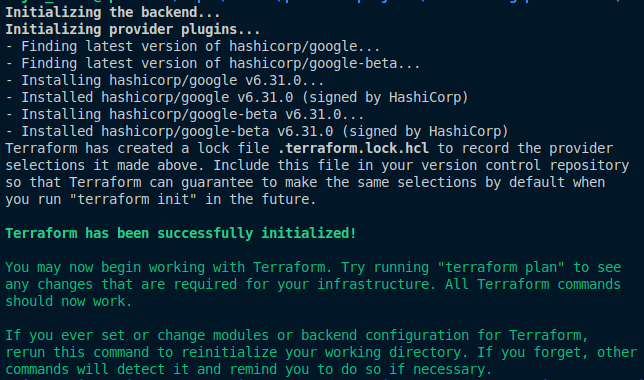

### 8. VPC Modules
- VPC: Creates a custom network and subnet
**Terraform Module Usage Tip**

Modules like `modules/vpc` are not standalone Terraform projects. They must be called from the root `main.tf`, where the provider block is defined and the backend is configured.

Running `terraform init` or `terraform plan` inside a module directory will result in errors like:
> Inconsistent dependency lock file

Always execute Terraform commands from the root project directory.

Screenshot 8: Terminal showing applied resources with outputs \
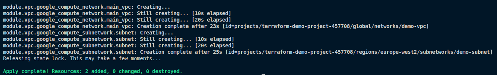

### 9. Resources Created
- VPC: `demo-vpc`
- Subnet: `demo-subnet` (CIDR: 10.0.1.0/24)

Screenshot 9: GCP Console showing VPC and subnet \
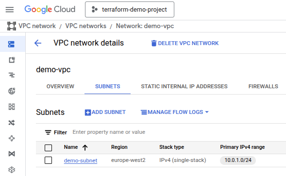

### 10. Cloud SQL Module

This module creates a PostgreSQL Cloud SQL instance with IAM authentication enabled.

**Common Issue: VPC network input format**

Cloud SQL’s `private_network` input requires the **full self-link** to the VPC, not just the name.

Incorrect:
```bash
  network = module.vpc.vpc_name
```
Correct:
```bash
  network = module.vpc.vpc_self_link
```

Resources created:
- Cloud SQL PostgreSQL 13 instance named `demo-sql`
- IAM user access for `rajoo.uddin@example.com`

**Tips & Findings**  
- The `type = "CLOUD_IAM_USER"` allows secure login without storing passwords  
- Make sure to use the VPC name as the `network` input (e.g., from the VPC module outputs)  
- You can later connect to this securely from apps or Looker Studio via Cloud SQL Auth Proxy

**Common Issue: Cloud SQL – SERVICE_NETWORKING_NOT_ENABLED**

When creating a Cloud SQL instance with a private IP, you must enable the Service Networking API:

1. Go to https://console.cloud.google.com/apis/library
2. Search and enable: "Service Networking API"
3. Retry Terraform apply

CLI:
```bash
gcloud services enable servicenetworking.googleapis.com --project=terraform-demo-project-457708
```

**Cloud SQL Private IP Setup Note**

To connect Cloud SQL over private IP, a VPC must have a private services access (PSA) connection to `servicenetworking.googleapis.com`.

One-time CLI setup:
```bash
gcloud compute addresses create google-managed-services \
  --global --purpose=VPC_PEERING --prefix-length=16 \
  --network=demo-vpc --project=terraform-demo-project-457708

gcloud services vpc-peerings connect \
  --service=servicenetworking.googleapis.com \
  --ranges=google-managed-services \
  --network=demo-vpc --project=terraform-demo-project-457708
```

### Cloud SQL IAM Authentication Setup

To securely connect to the PostgreSQL instance using **IAM authentication**, the following were implemented:

- **IAM-based user** created via Terraform using `type = "CLOUD_IAM_USER"`
- **PostgreSQL flag** `cloudsql.iam_authentication` was enabled via Terraform

```bash
settings {
  tier = "db-f1-micro"
  ip_configuration {
    ipv4_enabled    = false
    private_network = var.network
  }

  database_flags {
    name  = "cloudsql.iam_authentication"
    value = "on"
  }
}
```

IAM roles were granted manually via the GCP Console to allow secure access:

- Cloud SQL Client
- Cloud SQL Instance User

> **Note**: After changing the Cloud SQL settings, terraform apply was re-run to update the instance without destroying it. This ensures changes like database flags take effect safely.


Screenshot 10a: SQL instance showing in GCP console \
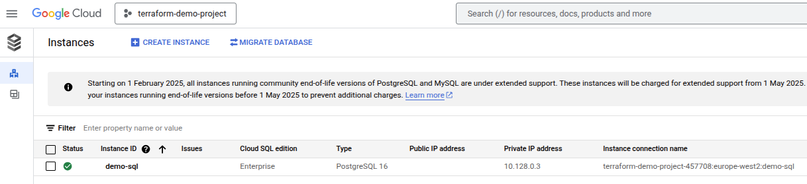 \

Screenshot 10b: SQL IAM user setup visible under Users tab \
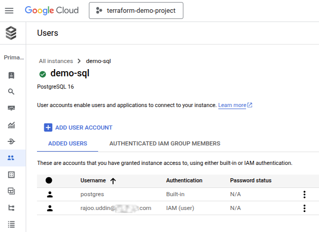

Screenshot 10c: SQL settings page showing the enabled `cloudsql.iam_authentication` flag \
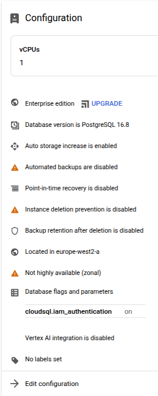


### 11. CI/CD with GitHub Actions
To automate the provisioning process, a GitHub Actions pipeline was configured. This workflow runs automatically on any push to main and includes:
- Terraform init (terraform init)
- Terraform formatting check (terraform fmt)
- Terraform validation (terraform validate)
- Terraform planning (terraform plan)
- Terraform apply (only after manual approval)

**Key Implementation Details**:

The workflow is defined at .github/workflows/terraform.yml
- A GCP service account key is stored securely in GitHub Secrets as GCP_SA_KEY
- On push to main, the workflow runs formatting, validation, planning
- Apply is paused for manual approval using GitHub Environments

Screenshot 11: GitHub Actions workflow showing successful Plan, Apply and auto Approval \
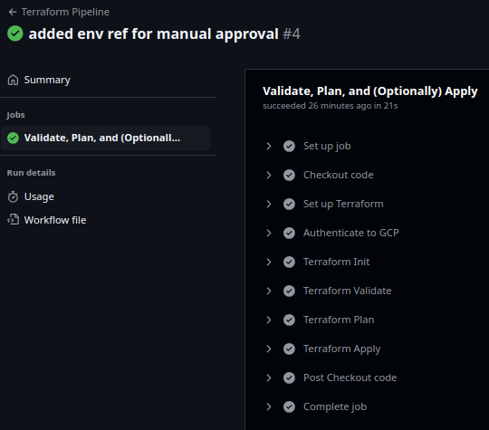

### 12. Terraform Linting Check
The pipeline uses `terraform fmt -check -recursive` to ensure consistent Terraform code formatting.
- If any `.tf` files are incorrectly formatted, the GitHub Actions workflow will fail at the linting step.
- Locally you can fix formatting by running:

```bash
terraform fmt -recursive
```

Screenshot 12: GitHub Actions showing Terraform formatting check \
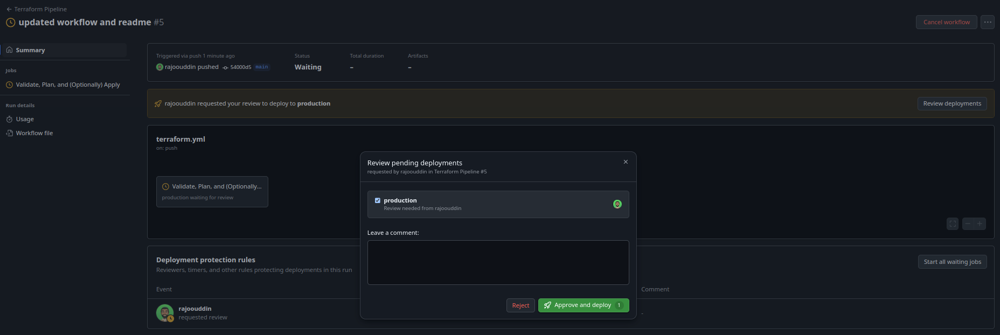

### 13. Manual Approval for Terraform Apply
To simulate real-world infrastructure change control, the GitHub Actions workflow requires manual approval before applying Terraform changes.

**Implementation Details**:
- Environment: production
- Protection Rule: Required reviewer approval
- Behavior:
-- After Terraform plan, the workflow pauses.
-- Reviewer (yourself, or later your client) must approve the apply through GitHub’s "Environments" interface.
-- Once approved, Terraform apply executes.

Screenshot 13: GitHub Actions workflow paused awaiting manual approval \


### 14. Usage Instructions
If you want to use or adapt this project:

1. **Fork this repository** to your own GitHub account.
2. **Clone your forked repo** locally.
3. Update the following:
   - `backend.tf`: change the GCS bucket name if needed.
   - `main.tf` and `variables.tf`: update any project-specific values (project ID, regions).
4. **Set up your GCP Service Account**:
   - Create a new service account in GCP with necessary permissions.
   - Download the JSON key file.
   - Encode it to base64 and store it in GitHub Secrets as `GCP_SA_KEY`.
5. **Review the GitHub Actions workflow**:
   - Ensure the environment name matches (`production`) or adjust as needed.
   - Set up required reviewers for manual apply approval if needed.
6. **Push changes** — the GitHub Actions pipeline will automatically validate and plan infrastructure changes!

---

### Future Improvements
- Extend module library (e.g., GKE, Load Balancers, Cloud Storage modules)
- Implement dynamic branching strategies (plan on PR, apply on merge)
- Add testing stages with `terratest` or `checkov`
- Automate service networking connection creation in Terraform

---
